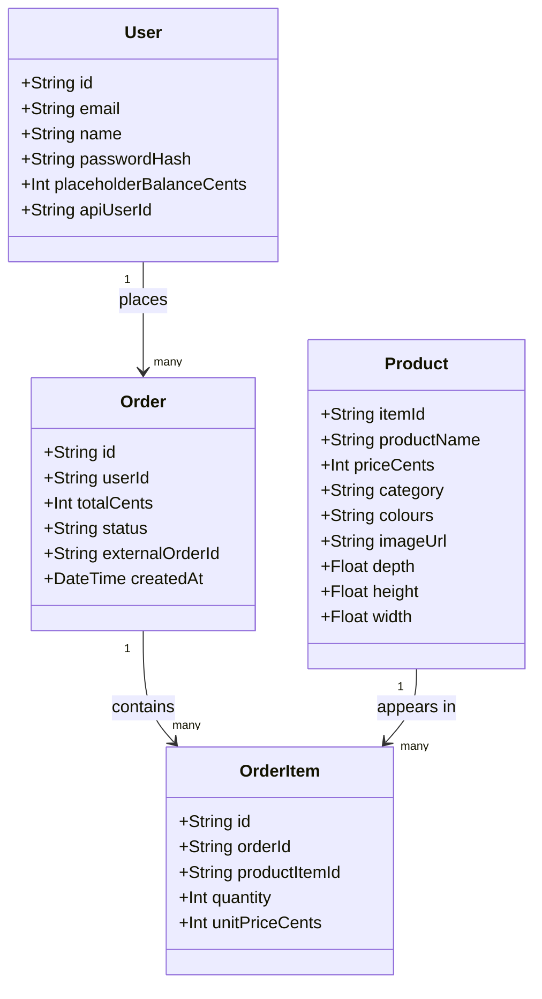

# Architecture

## Data model



### In plain English

**User** is someone who can log in. They have an email and a scrambled password. `apiUserId` is the ID the furniture shop's API knows them by (e.g. `u001`) — that's how our login connects to their real balance. `placeholderBalanceCents` is a temporary stand-in used before we connect the real API; it disappears from view once Lab 2 is done.

**Product** is one item in the furniture catalogue. `itemId` (e.g. `CHR-001`) is the shop's own identifier, so it's what we use to talk to the API about a product. `imageUrl`, `depth`, `height` and `width` come from the shared MongoDB catalogue — the dimensions aren't available through any API endpoint at all, which is a reason to use Mongo rather than only the API.

**Order** is one purchase. `externalOrderId` is what the real API gives back when an order succeeds, so our record can be traced to theirs.

**OrderItem** is one line within an order — which product, how many, and the price *at the time of purchase*. We store the price on the line rather than reading it from Product later, because catalogue prices can change and an old receipt should never silently change with them.

### Two decisions worth knowing

**Prices are integer cents everywhere.** Computers get `0.1 + 0.2` slightly wrong, and a budget app that's a cent out is a broken demo. We store `129900` and format it as `$1,299.00` only when displaying.

**Remaining budget is calculated, never stored.** We add up orders and subtract from the balance each time we're asked. The tempting alternative — keeping a "remaining" number and adjusting it on each order — drifts out of sync after any crash or bug, and then the number on screen is a lie you can't trace. Once the real API is connected, the balance comes from the API anyway, which makes this moot in the best way.

## Where things live

```
my-furniture-buyer-app/
├── CLAUDE.md                  standing instructions
├── requirements.md            what it must do
├── architecture.md            this file
├── furniture-buyer-day1-plan.md   the day's plan
├── prisma/
│   ├── schema.prisma          the data model above, as code
│   ├── seed.ts                demo users + placeholder products
│   └── dev.db                 the database itself, one file
├── scripts/
│   └── import-catalogue.ts    pulls the 762 real products from shared MongoDB
├── src/
│   ├── app/                   one folder per page/URL
│   │   ├── login/
│   │   ├── catalogue/
│   │   ├── orders/
│   │   └── api/               server endpoints
│   ├── components/            reusable pieces
│   └── lib/                   shared logic — db, session, money, API client
└── .env                       secrets, never committed
```

The rule: **`app/` is what a user sees, `lib/` is the thinking, `components/` is anything that appears more than once.**

## Three sources of data, and why

| Source | Gives us | Why not one of the others |
|---|---|---|
| SQLite (local) | Our users, logins, our record of orders | The API has no concept of *our* app's users or login |
| Shared MongoDB (read-only) | 762 real products, image URLs, dimensions | Fastest way to real images; dimensions exist nowhere else |
| Furniture-shop REST API | Real balance, real orders | The only thing that can actually spend money |

## Agent tool design (Level 3)

Four tools, described honestly about what the API cannot do. If a description overpromises, the model will confidently ask for something the API can't deliver, and we get a wrong answer instead of a clear failure.

| Tool | Does | The honest limitation |
|---|---|---|
| `search_catalogue` | Find products, optionally filtered by category | Exact, case-insensitive **category** match only. Not price, colour, or vibe. |
| `get_product` | Full detail, dimensions and image for one item | One item at a time. Never for browsing. |
| `check_balance` | The current user's remaining funds | Only ever the current user — there is no other user to look up. |
| `place_order` | Buy one item for the current user | Really spends real money. Must confirm with the user first. |

Filtering by price, colour or "cheap" happens in our code, over the results a category search returns — never assumed of the API call.
